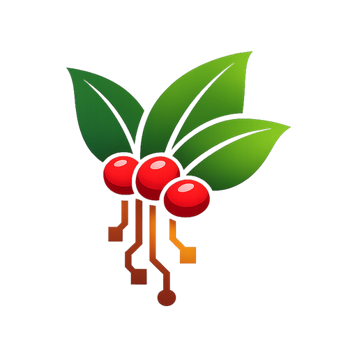
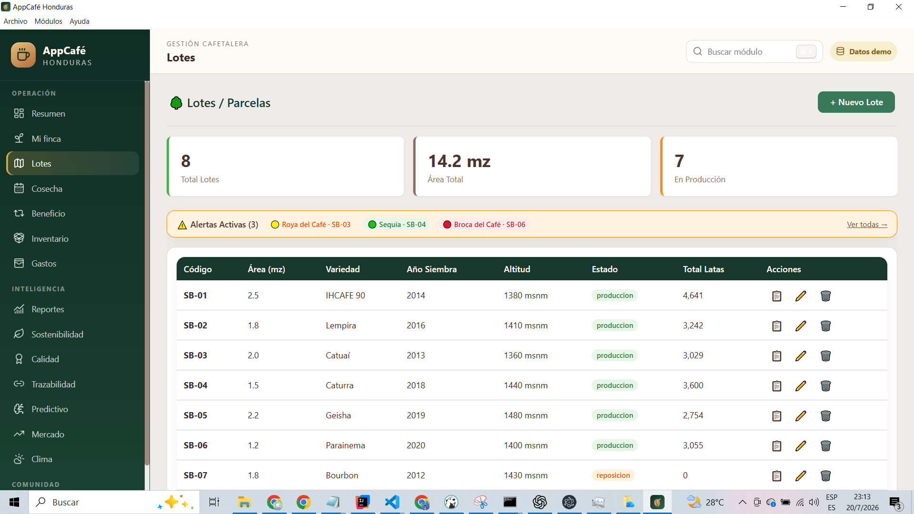
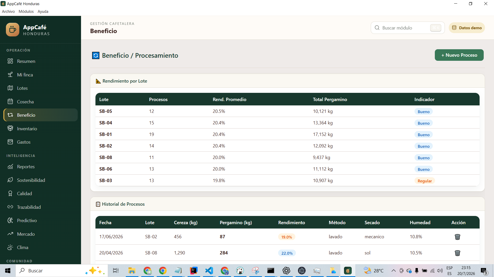

<p align="center">
  
</p>

<h1 align="center">Cafetal OS</h1>

<p align="center">
  Sistema open source, offline-first y multiplataforma para producción, corte, acopio, beneficio, inventario, calidad y comercialización del café.
</p>

<p align="center">
  <strong>Vue 3 · Electron · SQL.js · MCP stdio · Vitest · Playwright · MIT</strong>
</p>

## Qué es Cafetal OS

Cafetal OS convierte la operación diaria del café en información útil y trazable. Está pensado para fincas, productores, cuadrillas, cooperativas, centros de acopio, beneficios, compradores, tostadores y organizaciones que necesitan trabajar localmente incluso cuando la conectividad es limitada.

La aplicación permite dos rutas de origen:

- **Café propio:** finca → lote → corte → beneficio → inventario → calidad → venta.
- **Café comprado:** proveedor → recepción por peso → control de calidad → inventario o beneficio → venta.

La base productiva y la base demostrativa permanecen separadas. El sistema no necesita una conexión permanente a internet para operar.

## Cafetal OS 2.6.0

Esta versión incorpora flujos pensados para trabajo real de campo y acopio:

- **Planilla semanal de cortadores:** filas por persona y columnas por día/fecha, con totales, kilos y pago.
- **Temporadas de cosecha:** unidad, precio y peso de referencia predeterminados.
- **Registro masivo:** tablas amplias para lotes, cortadores, cosecha, beneficio, inventario, gastos, proveedores, compras, clima y calidad.
- **Pegado desde Excel:** importa rangos tabulados, resuelve listas y valida cada fila antes de guardar.
- **Compras y acopio:** recepción de cereza, pergamino húmedo, pergamino seco, verde y tostado.
- **Ventas de café:** salida comercial transaccional, cliente, factura, precio y restitución al anular.
- **Kardex y alertas:** saldo por producto/origen, capas FIFO y avisos de permanencia o humedad.
- **Control de calidad de compras:** humedad, defectos, decisión y observaciones antes de incorporar inventario.
- **Rentabilidad semanal de corte:** seguimiento operativo de pago, transformación, costo y margen estimado.
- **Educación interactiva:** rutas, progreso, lectura profunda y evaluaciones por usuario.
- **Ayuda responsive:** navegación y contenido adaptados a ventanas pequeñas.
- **Membrete configurable:** identidad institucional, logo, contacto, colores y pie para PDF.
- **MCP local ampliado:** tools para planillas de corte y compras/acopio, además de finca, calidad, inventario y finanzas.
- **Inspección y depuración:** `F12`, menú **Ver** y clic derecho → **Inspeccionar elemento**.
- **Clima por Open-Meteo:** condiciones actuales, presión superficial, pronóstico de siete días, geolocalización, búsqueda manual, caché de 30 minutos y modo offline.
- **Planilla semanal corregida:** la selección de lote vuelve a consultar y guardar la semana sin el error `loteId is not defined`.

Consulte [Notas de la versión 2.6.0](docs/RELEASE_NOTES_2.6.0.md), la guía [Clima por Open-Meteo](docs/CLIMA_OPEN_METEO.md) y [Ventas, kardex y almacenamiento](docs/VENTAS_KARDEX_Y_ALMACENAMIENTO.md).

## Vista general

<table>
  <tr>
    <td width="50%"></td>
    <td width="50%"></td>
  </tr>
  <tr>
    <td align="center"><strong>Lotes y parcelas</strong></td>
    <td align="center"><strong>Beneficio y procesamiento</strong></td>
  </tr>
</table>

La galería reproducible de cada versión se genera en `IMG/desktop/` y `IMG/mobile/` mediante Playwright. Incluye planilla semanal, registro masivo, compras, ventas, kardex, clima conectado, configuración, ayuda y educación.

## Funciones principales

### Producción propia

- Finca, lotes, variedades, densidad, altitud y certificaciones.
- Cortadores, cortes diarios y planillas semanales.
- Beneficio húmedo/seco, fermentación, secado, humedad y rendimiento.
- Inventario, movimientos, ventas, gastos y rentabilidad.

### Compra y transformación

- Proveedores de café y datos de origen.
- Compras por peso y estado físico del producto.
- Revisión de humedad, defectos y aceptación.
- Entrada automática a inventario para compras aprobadas o condicionadas.
- Envío de cereza o pergamino húmedo comprado a beneficio.

### Inteligencia y trazabilidad

- Calidad y catación, sostenibilidad, clima conectado con Open-Meteo y alertas fitosanitarias.
- Trazabilidad local con códigos, QR y cadena hash operativa.
- Reportes productivos, financieros y de rentabilidad.
- Servidor MCP local por `stdio` para clientes de inteligencia artificial.

### Comunidad y aprendizaje

- Educación interactiva con rutas y evaluaciones.
- Ayuda integrada y responsive.
- Clientes, campañas, fidelización y perfiles de café.
- Documentación abierta, gobernanza y guías de contribución.

## Inicio rápido en Windows

Requisitos:

- Windows 10 u 11.
- Node.js 22.12 o superior.
- Conexión a internet durante la primera instalación de dependencias y del binario de Electron.

Pasos:

1. Descomprima el repositorio en una carpeta nueva.
2. Ejecute `instalar.bat`.
3. Ejecute `desarrollar.bat`.
4. Inicie sesión con `admin` / `admin`.
5. Cambie la contraseña en **Configuración → Mi cuenta**.
6. Cargue la demostración desde **Configuración → Datos y demo**.

> No mezcle versiones nuevas sobre carpetas antiguas. Cada release debe instalarse o descomprimirse en una carpeta independiente.

## Inicio desde terminal

```bash
npm ci
npx install-electron --no
npm run dev
```

Para regenerar y abrir la demo:

```bash
npm run demo:reset
```

## Flujo recomendado de operación

### Finca productora

1. Configure **Perfil operativo → Productor**.
2. Registre finca y lotes.
3. Cree los cortadores.
4. Abra **Cosecha → Planilla semanal**.
5. Registre beneficio, inventario, gastos y calidad.
6. Revise reportes y margen por semana/lote.

### Centro de acopio o beneficio

1. Configure **Perfil operativo → Comprador / beneficiador**.
2. Cree proveedores.
3. Registre compras individuales o masivas.
4. Revise humedad y defectos.
5. Apruebe, condicione o rechace la recepción.
6. Incorpore inventario o envíe la compra a beneficio.

### Operación mixta

Seleccione **Mixta** para conservar ambos flujos en una misma instalación.

## Registro masivo

Los módulos operativos muestran un botón de registro masivo. La matriz ocupa casi toda la ventana, mantiene cabeceras visibles y admite listas desplegables para relaciones.

Flujo:

1. agregue filas o pegue una tabla desde Excel;
2. pulse **Validar**;
3. corrija las filas señaladas;
4. pulse **Guardar todos**.

El bloque se guarda dentro de una transacción: si una fila es inválida, no se persiste ninguna. Consulte [Registro masivo](docs/REGISTRO_MASIVO.md).

## Planillas de corte

La planilla semanal reproduce el formato de campo habitual:

- primera columna: cortadores;
- columnas siguientes: lunes, martes, miércoles, jueves, viernes y fecha real;
- totales por persona, día, kilos y pago;
- soporte de cinco, seis o siete días;
- unidad en lata, canasta o kilogramo;
- conversión configurable a kilogramos.

Consulte [Planillas semanales de corte](docs/PLANILLAS_CORTE.md).

## Comandos del proyecto

| Comando | Resultado |
|---|---|
| `npm run dev` | Ejecuta Vue y Electron con recarga en caliente. |
| `npm run demo:reset` | Regenera y abre la base demo. |
| `npm run demo:generate` | Genera `database/cafetal-os-demo.db`. |
| `npm run db:template` | Regenera la plantilla productiva vacía. |
| `npm test` | Ejecuta pruebas unitarias y de componentes. |
| `npm run test:coverage` | Genera cobertura de Vitest. |
| `npm run test:e2e` | Ejecuta pruebas de humo sobre Electron. |
| `npm run screenshots` | Genera galerías desktop y móvil en `IMG/`. |
| `npm run mcp` | Inicia el servidor MCP productivo en solo lectura. |
| `npm run mcp:demo` | Inicia MCP sobre la base demostrativa. |
| `npm run mcp:write` | Habilita las tools explícitas de escritura. |
| `npm run mcp:inspect` | Ejecuta la prueba de humo del servidor MCP. |
| `npm run lint` | Valida JavaScript y Vue con ESLint. |
| `npm run verify` | Comprueba archivos esenciales de la entrega. |
| `npm run security:audit` | Audita dependencias con npm. |
| `npm run build:app` | Compila main, preload y renderer. |
| `npm run build:win` | Genera NSIS y portable para Windows. |
| `npm run build:mac` | Genera DMG y ZIP en macOS. |
| `npm run build:linux` | Genera AppImage y DEB en Linux. |

## Capturas automatizadas

En Windows:

```bat
capturar-pantallas.bat
```

O desde terminal:

```bash
npm run screenshots
```

El proceso regenera la demo, compila, abre Electron, inicia sesión y captura versiones desktop y móvil. No use `npx run screenshots`; el comando correcto es `npm run screenshots`.

Consulte [Capturas con Playwright](docs/CAPTURAS_PLAYWRIGHT.md) y [Galería de interfaces](IMG/README.md).

## Inteligencia artificial local con MCP

Cafetal OS puede actuar como servidor MCP por `stdio`. En modo de lectura publica tools para finca, lotes, corte, planillas, compras, beneficio, inventario, finanzas, calidad, alertas, trazabilidad y contexto de reportes.

```bash
npm run mcp:demo
```

La escritura está deshabilitada por defecto y requiere `--write`. No se expone SQL libre ni la tabla de usuarios.

Consulte [MCP local para inteligencia artificial](docs/MCP_IA_LOCAL.md).

## Formularios asistidos y PDF profesionales

Los formularios críticos aplican reglas de dominio, cálculos derivados y advertencias contextuales. La misma validación se ejecuta nuevamente en el proceso principal antes de guardar.

Los PDF pueden incluir:

- logotipo;
- nombre e identificación institucional;
- dirección, teléfono, correo y web;
- responsable;
- colores corporativos;
- pie institucional y numeración.

Consulte [Validaciones inteligentes](docs/VALIDACIONES_INTELIGENTES.md) y [Reportes PDF y membrete](docs/REPORTES_MEMBRETE.md).

## Diseño responsive

La interfaz se adapta desde escritorio hasta ventanas de 360 píxeles:

- sidebar convertido en drawer;
- scroll independiente del menú y del panel;
- tablas transformadas en tarjetas cuando corresponde;
- matrices masivas con desplazamiento controlado;
- modales de trabajo en pantalla casi completa;
- ayuda y educación adaptadas a móvil.

Esta arquitectura prepara una futura evolución hacia PWA, Android e iOS; la versión actual sigue siendo Electron. Consulte [Responsive y evolución móvil](docs/RESPONSIVE_Y_MOVIL.md).

## Arquitectura

```text
src/main/                    proceso principal, base, autenticación, dominio, MCP e IPC
src/preload/                 contrato seguro expuesto al renderer
src/renderer/src/            shell y componentes Vue 3
src/renderer/public/legacy/  módulos encapsulados durante la migración
src/renderer/public/legacy/registro-masivo.js  matrices y planillas semanales
database/                    esquema, semillas y bases plantilla
scripts/                     demo, validación, capturas, MCP y builds
tests/unit/                  Vitest y Vue Test Utils
tests/e2e/                   Playwright Electron
IMG/                         galería desktop/móvil
docs/                        manuales funcionales y técnicos
branding/                    identidad visual
mcp/                         ejemplos de clientes MCP
```

La migración es incremental: navegación, autenticación, dashboard y configuración son Vue 3; varios módulos operativos todavía se ejecutan mediante adaptadores heredados hasta su conversión a componentes nativos.

## Datos y privacidad

- Producción: `cafetal-os.db` dentro de `userData` de Electron.
- Demo runtime: `cafetal-os-demo-runtime.db`.
- Plantillas del repositorio: `database/cafetal-os.db` y `database/cafetal-os-demo.db`.
- Usuarios: `security/users.json`, con `scrypt` y salt individual.
- Respaldos: `Documentos/CafetalOS/Respaldos/`.
- MCP no abre un puerto de red por defecto; el cliente de IA determina el tratamiento posterior de las respuestas.

Antes de actualizar una base productiva, cree un respaldo.

## Cómo participar

La comunidad necesita cafetaleros, cortadores, administradores, técnicos, catadores, compradores, diseñadores, formadores y desarrolladores.

Áreas especialmente valiosas:

- revisar la planilla semanal con cuadrillas reales;
- validar unidades y pagos de corte;
- documentar procesos de compra, acopio y liquidación;
- proponer reglas de calidad y trazabilidad;
- crear lecciones educativas;
- probar matrices masivas y layouts móviles;
- migrar módulos heredados a Vue 3.

Lea [CONTRIBUTING.md](CONTRIBUTING.md), [GOVERNANCE.md](GOVERNANCE.md) y [COMMUNITY.md](COMMUNITY.md).

## Documentación

### Operación

- [Manual de usuario](docs/MANUAL_USUARIO.md)
- [Catálogo de módulos](docs/MODULOS.md)
- [Planillas semanales de corte](docs/PLANILLAS_CORTE.md)
- [Registro masivo](docs/REGISTRO_MASIVO.md)
- [Compras, acopio y transformación](docs/COMPRAS_ACOPIO.md)
- [Educación interactiva](docs/EDUCACION_INTERACTIVA.md)
- [Configuración y demo](docs/CONFIGURACION_Y_DEMO.md)
- [Reportes PDF y membrete](docs/REPORTES_MEMBRETE.md)
- [Galería de interfaces](IMG/README.md)

### Desarrollo

- [Guía de desarrollo](docs/DESARROLLO.md)
- [Arquitectura](docs/ARQUITECTURA.md)
- [Modelo de datos](docs/MODELO_DATOS.md)
- [Contrato IPC](docs/API_IPC.md)
- [MCP local](docs/MCP_IA_LOCAL.md)
- [Clima por Open-Meteo](docs/CLIMA_OPEN_METEO.md)
- [Pruebas](docs/TESTING.md)
- [Capturas con Playwright](docs/CAPTURAS_PLAYWRIGHT.md)
- [Compilación y distribución](docs/BUILD.md)
- [Publicar releases en GitHub](docs/PUBLICAR_RELEASE_GITHUB.md)
- [Checklist de release](docs/RELEASE_CHECKLIST.md)

### Comunidad

- [Cómo contribuir](CONTRIBUTING.md)
- [Gobernanza](GOVERNANCE.md)
- [Comunidad](COMMUNITY.md)
- [Soporte](SUPPORT.md)
- [Código de conducta](CODE_OF_CONDUCT.md)
- [Roadmap](docs/ROADMAP.md)
- [Historial de cambios](CHANGELOG.md)
- [Citación](CITATION.cff)

## Publicar Cafetal OS 2.6.0 en GitHub

Después de subir el código a `main`:

```bash
git add .
git commit -m "release: Cafetal OS 2.6.0"
git push origin main
git tag -a v2.6.0 -m "Cafetal OS 2.6.0"
git push origin v2.6.0
```

El workflow `.github/workflows/release.yml` compila Windows, macOS y Linux, verifica que la etiqueta coincida con `package.json`, genera `SHA256SUMS.txt` y crea la GitHub Release.

En Windows también puede ejecutar:

```bat
publicar-release.bat 2.6.0
```

## Estado del proyecto

Cafetal OS está en desarrollo activo. No debe utilizarse como única fuente tributaria, contractual, de certificación o diagnóstico agronómico sin validación profesional y respaldos independientes.

## Licencia y marca

El código se distribuye bajo licencia MIT. La identidad **Cafetal OS** se documenta en [Identidad visual](docs/IDENTIDAD_VISUAL.md).
